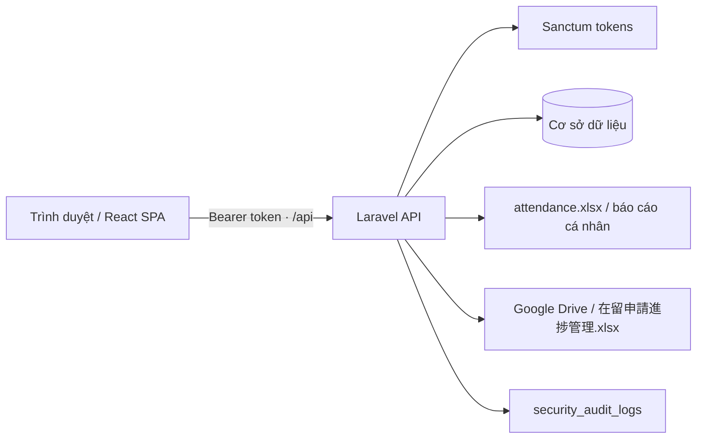

# Kiến trúc và chỉ mục mã nguồn

## Tổng quan luồng xử lý

Frontend chỉ giữ token ở `sessionStorage` hoặc `localStorage`; mọi quyết định về nhân viên, quyền sở hữu chấm công và dữ liệu nhạy cảm đều được thực hiện ở backend.

## Frontend

| Tệp/khu vực | Trách nhiệm |
| --- | --- |
| `src/main.tsx` | Điểm khởi động React; khởi tạo theme trước khi render để tránh nháy màu. |
| `src/App.tsx` | Khai báo router, bọc `ThemeProvider`/`AuthProvider`, và bảo vệ các trang nội bộ. |
| `src/services/api.ts` | Axios dùng `VITE_API_URL` hoặc ghép `VITE_BACKEND_URL/api`; tự chèn `Authorization: Bearer` và quản lý token. |
| `src/contexts/AuthContext.tsx` | Kiểu dữ liệu người dùng, đăng nhập/đăng xuất, tải lại `/me` và trạng thái đang khởi tạo phiên. |
| `src/contexts/ThemeContext.tsx`, `src/utils/theme.ts` | Chế độ sáng/tối, ưu tiên đã lưu hoặc theme hệ điều hành, lớp CSS `dark`. |
| `src/components/auth/ProtectedRoute.tsx` | Hiện màn hình chờ trong lúc xác minh token; chuyển khách đến `/login`; tài khoản dùng mật khẩu tạm được chuyển đến `/change-password`. |
| `src/layouts/MainLayout.tsx` | Khung chung gồm sidebar và nội dung route con. |
| `src/components/layout/Sidebar.tsx` | Điều hướng giữa các không gian làm việc, thông tin phiên và công tắc theme. |
| `src/components/layout/Header.tsx` | Tiêu đề/đầu trang dùng lại cho các trang. |
| `src/pages/Login.tsx` | Biểu mẫu email/mật khẩu/ghi nhớ; hiển thị lỗi API và quay lại route được yêu cầu sau đăng nhập. |
| `src/pages/EmployeeRoom.tsx` | Màn hình nghiệp vụ chính: bắt đầu/kết thúc làm việc, nghỉ, ra ngoài, quản lý work session, tải Excel, danh sách đang hoạt động, việc được giao và thông báo cục bộ. `JapaneseTimePicker` là bộ chọn giờ dùng cho các modal. |
| `src/pages/OrganizationDesign.tsx` | Tải tổ chức, lọc theo văn phòng, thống kê trạng thái, xem chi tiết nhân viên và giao việc. Các component ở cuối tệp là phần trình bày/modal nội bộ của trang. |
| `src/pages/BusinessQuest.tsx`, `AI.tsx`, `ApprovalRoom.tsx` | Các không gian nghiệp vụ hiện có. |
| `src/features/case-workspace/*` | Workspace hồ sơ theo 6 tab: tổng quan, checklist tài liệu, task, deadline, bên liên quan và timeline. Tất cả thao tác dùng API hiện có, hỗ trợ light/dark và responsive. |
| `src/pages/VisaProgress.tsx`, `src/features/visa-progress/*` | Dashboard chỉ đọc cho tiến độ hồ sơ tại lưu trú: gọi API, lọc/search dữ liệu Excel, hiển thị nguồn, hạn xử lý và bảng responsive. |
| `src/pages/ComingSoon.tsx` | Thành phần placeholder có tiêu đề truyền vào. |
| `src/index.css`, `src/App.css` | Token giao diện, dark mode, animation và các style toàn cục. |
| `src/assets/*`, `public/images/*`, `public/*.svg` | Ảnh minh họa, avatar, biểu tượng và favicon; không chứa logic chạy. |
| `src/types/index.ts` | Điểm tập trung dự kiến cho kiểu dùng chung; hiện chưa khai báo kiểu nào. |
| `vite.config.ts` | React + Tailwind Vite plugin; build dùng base `/DEMO-WEB/`, dev dùng `/`. |
| `eslint.config.js`, `tsconfig*.json` | Quy tắc lint và biên dịch TypeScript. |

`src/pages/EmployeeRoom.tsx.backup` là bản sao lưu, không được Vite nhập hay thực thi; không dùng làm nguồn chuẩn khi sửa tính năng.

### Điều hướng frontend

| URL | Bảo vệ | Màn hình |
| --- | --- | --- |
| `/login` | Công khai | Đăng nhập. |
| `/change-password` | Có token hợp lệ | Đổi mật khẩu tạm thời; thành công sẽ thu hồi token và yêu cầu đăng nhập lại. |
| `/` | Có token hợp lệ | Employee Room. |
| `/organization` | Có token hợp lệ | Organization Design. |
| `/quests`, `/ai`, `/approvals` | Có token hợp lệ | Không gian nghiệp vụ. |
| `/visa-progress` | Có token hợp lệ | 在留申請進捗管理; API còn yêu cầu `case.view`. |

Mọi URL khác được chuyển về `/`. `BrowserRouter` dùng `import.meta.env.BASE_URL`, vì vậy đường dẫn vẫn hoạt động khi deploy dưới `/DEMO-WEB/`.

## Backend

| Tệp/khu vực | Trách nhiệm |
| --- | --- |
| `bootstrap/app.php` | Khởi tạo Laravel, định nghĩa route API/web/console/health và gắn hai middleware bảo mật toàn cục. |
| `routes/api.php` | Bề mặt REST API. Login giới hạn 5 lần/phút; các route còn lại dùng Sanctum và giới hạn 60 lần/phút. |
| `routes/web.php`, `routes/console.php` | Route trang chào Laravel và điểm đăng ký lệnh console. |
| `app/Http/Controllers/Api/AuthController.php` | Đăng nhập, `/me`, đổi mật khẩu và đăng xuất; cấp Sanctum token 12 giờ hoặc 30 ngày khi ghi nhớ. |
| `app/Http/Middleware/RequirePasswordChange.php` | Chặn API nghiệp vụ khi tài khoản còn cờ `must_change_password`; vẫn cho phép `/me`, đổi mật khẩu và đăng xuất. |
| `app/Http/Controllers/Api/AttendanceController.php` | Bắt đầu ca, đổi trạng thái, liệt kê người đang hoạt động, tải báo cáo Excel cá nhân và kiểm soát ownership. |
| `app/Http/Controllers/Api/WorkSessionController.php` | Tạo/kết thúc phiên công việc; chỉ một phiên active trên một attendance tại cùng thời điểm. |
| `app/Http/Controllers/Api/OrganizationController.php` | Trả về danh sách nhân viên, trạng thái hiện tại và thống kê; chỉ manager/admin nhận PII. |
| `app/Http/Controllers/Api/CaseWorkspaceController.php` | Trả dữ liệu tổng hợp, tiến độ, thiếu tài liệu và áp dụng template tài liệu có phiên bản cho một hồ sơ. |
| `app/Http/Controllers/Api/CaseWorkspaceItemController.php` | CRUD các bên liên quan, deadline, task và ghi timeline của hồ sơ. |
| `app/Services/CaseDocumentChecklistService.php` | Sao chép template đang hiệu lực thành checklist riêng của hồ sơ theo cách idempotent. |
| `app/Http/Controllers/Api/EmployeeTaskController.php` | Giao việc (manager/admin), lấy việc của tôi, xác nhận, bắt đầu và hoàn tất công việc. |
| `app/Http/Controllers/Api/VisaProgressController.php` | API read-only cho 在留申請進捗管理; cache dashboard ngắn, không lộ thông tin credential và trả lỗi cấu hình/nguồn/file theo contract. |
| `app/Http/Middleware/SecurityHeaders.php` | Thêm cache-control, CSP, anti-frame, referrer, permissions và HSTS phù hợp cho API. |
| `app/Http/Middleware/SecurityEventAudit.php` | Ghi các response 401/403/429, khử trùng lặp theo IP/method/path/người dùng trong một phút. |
| `app/Services/AttendanceExcelService.php` | Đồng bộ attendance và work session vào workbook dùng chung `storage/app/attendance/attendance.xlsx`. |
| `app/Services/PersonalAttendanceReportService.php` | Tạo workbook trong bộ nhớ chỉ gồm dữ liệu của nhân viên hiện tại, phục vụ download. |
| `app/Services/GoogleDriveService.php` | Xác thực Service Account chỉ với scope `drive.readonly`, lấy metadata và tải workbook Google Drive vào temporary storage rồi xoá sau khi parse. |
| `app/Services/VisaProgressSpreadsheetService.php` | Dò sheet/header Excel, chuẩn hoá ngày/giá trị, chọn deadline vận hành, giữ nguyên status lạ và dựng summary cho dashboard. |
| `app/Services/SecurityAuditLogger.php` | Lưu audit log theo hướng fail-open, băm định danh và bỏ các khóa nhạy cảm trước khi ghi. |
| `app/Models/*.php` | Eloquent model, mass-assignable fields, casts và các quan hệ được mô tả trong [mô hình dữ liệu](DATA_MODEL.md). |
| `database/migrations/*.php` | Lịch sử tạo bảng/mở rộng schema; cần được chạy theo thứ tự thời gian. |
| `database/seeders/*.php` | Tạo dữ liệu nền; tài khoản/nhân viên demo chỉ được tạo trong `local/testing`, không chạy ở production. |
| `database/factories/UserFactory.php` | Factory User phục vụ test. |
| `tests/Feature/*.php` | Kiểm thử API, authorization, audit, báo cáo cá nhân, trạng thái ngoài văn phòng và work session. |
| `tests/Unit/AttendanceExcelServiceTest.php` | Kiểm thử cấu trúc/nội dung hai sheet Excel trong storage tạm. |
| `config/cors.php` | Chỉ cho phép `FRONTEND_URL`, Vite local và GitHub Pages; expose `Content-Disposition` để tải file. |
| `config/*.php` khác | Cấu hình Laravel chuẩn cho app, auth, Sanctum, DB, session, queue, mail, cache, filesystem, log, services và trusted proxy. |
| `resources/js/*`, `resources/css/app.css`, `public/index.php` | Entry assets/trang mặc định của Laravel; API hiện không dựa vào các asset này. |
| `railway.json` | Trước deploy chạy `php artisan migrate --force && php artisan db:seed --force`. |

## Nền tảng thu thập tài liệu theo loại hồ sơ (Phase 1A)

Miền chuẩn là `clients → case_files → case_documents ↔ received_documents`: client là khách hàng, case_file là 案件, case_document là một mục checklist, received_document là metadata của tài liệu/file/phiên bản thực nhận. Pivot `case_document_received_documents` hỗ trợ quan hệ nhiều–nhiều với liên kết duy nhất cho từng cặp.

Danh mục mới đi theo `case_types → case_type_document_rules → document_types`. Rule mô tả tài liệu ứng viên, không khẳng định nghĩa vụ pháp lý; mặc định `conditional`. DocumentType có code ổn định và document_group độc lập prefix. Model mới khai báo quan hệ với case, checklist, rule, prerequisite và employee; chưa có UI/API, seed master hoàn chỉnh hay tự sinh checklist theo rule mới.

CaseDocument có bốn trục varchar độc lập: necessity, collection, fulfillment, review; trạng thái ban đầu lần lượt là undetermined/not_started/undetermined/unreviewed. Constants nằm trong model để dùng khi triển khai validation ở phase sau. Trạng thái legacy và `file_url` vẫn phục vụ API/UI hiện tại; không tự chuyển URL sang received_documents và không tự đồng bộ các trạng thái. Template engine hiện tại không thay đổi.

`matters/tasks` vẫn là hệ AI/demo legacy, không dùng cho tính năng này và chưa migrate. Employee tasks, AI tools và approval execution giữ nguyên. Phase 1A không upload file, gửi yêu cầu ra ngoài, OCR hay gọi Google Drive. Chi tiết cột, FK và chính sách tương thích nằm trong [DATA_MODEL.md](DATA_MODEL.md).

## Quy ước trạng thái

| Miền | Giá trị |
| --- | --- |
| Attendance | `working`, `break`, `outside`, `offline` |
| Work session | `active`, `completed` |
| Employee task | `pending`, `accepted`, `in_progress`, `completed` |
| User role | `employee`, `manager`, `admin` |
| Employee | `active`, `on_leave`, `resigned` |

Luồng chấm công: `working` → `break`/`outside`/`offline`; khi quay về `working`, thời điểm kết thúc nghỉ/ra ngoài được đóng. Chuyển sang `offline` tự kết thúc work session đang active. Khi mở work session mới, phiên active trước đó cũng tự hoàn tất trong transaction.

Luồng giao việc: manager/admin tạo task `pending`; nhân viên xác nhận (`accepted`), bắt đầu (`in_progress`) và hoàn tất (`completed`).

### 在留申請進捗管理 (Phase 1)

Google Drive Excel là source of truth. `VisaProgressController` lấy dashboard từ cache 60 giây (hoặc bỏ cache bằng `?refresh=1`), `GoogleDriveService` tải file vào storage tạm, `VisaProgressSpreadsheetService` đọc xong rồi file tạm được xoá. Khi workbook có đủ sheet vận hành, service ghép `本人情報` (thông tin và `在留期限`), `資料管理` (`追完期限 1回目〜3回目`) và `請求関係` (`メッセージリンク`) theo `案件ID`. Deadline lưu trú và deadline nộp bổ sung được trả độc lập, theo nhóm status nghiệp vụ, để dashboard hiển thị hai luồng cảnh báo riêng. Phase 1 không tạo bảng database, không ghi Excel/Google Drive và không chạy scheduler.
