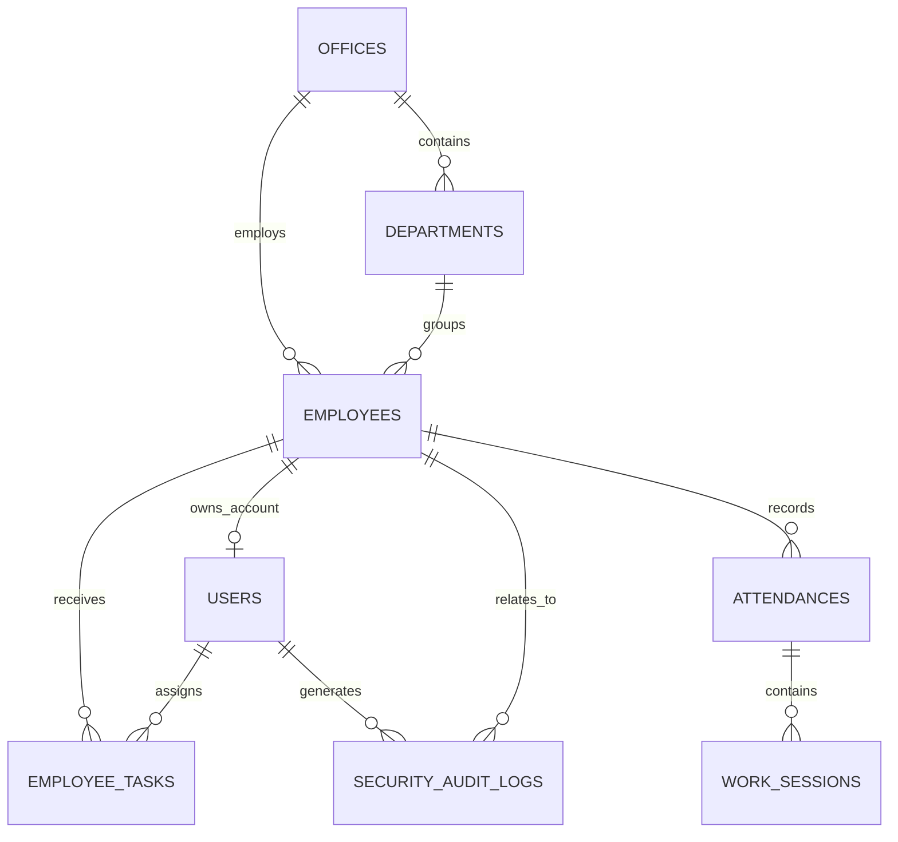
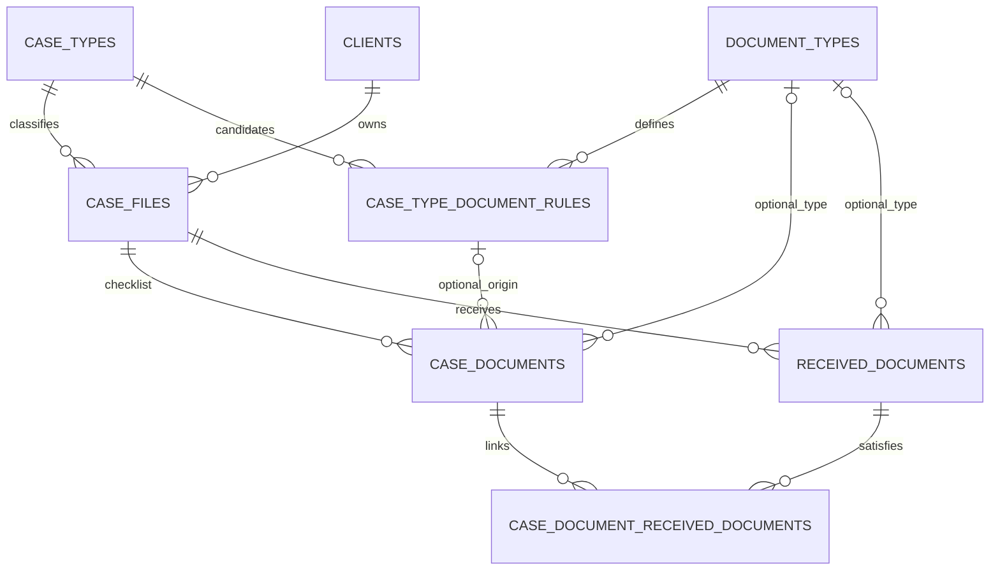
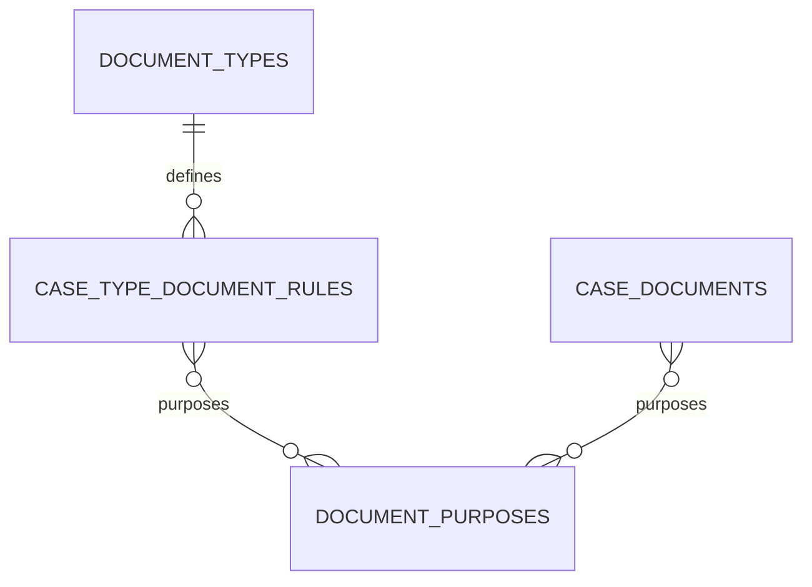

# Dữ liệu, bảo mật và vận hành

## Mô hình dữ liệu



| Bảng/model | Mục đích và trường đáng chú ý |
| --- | --- |
| `offices` / `Office` | Văn phòng: `office_code` duy nhất, tên, địa chỉ, ảnh phòng, trạng thái. |
| `departments` / `Department` | Phòng ban của office; unique theo cặp `office_id + department_code`. |
| `employees` / `Employee` | Hồ sơ nhân viên: mã duy nhất, tên/kana, nhân khẩu học, office/department, liên hệ, avatar, trạng thái. Dùng soft delete. |
| `users` / `User` | Tài khoản đăng nhập, liên kết tối đa một employee, role, active, yêu cầu đổi mật khẩu và lần đăng nhập gần nhất. Password được Laravel hash và ẩn khi serialize. |
| `personal_access_tokens` | Token Sanctum, có thời hạn do AuthController truyền vào khi tạo token. |
| `attendances` / `Attendance` | Một ca làm: employee, ngày, check-in/out, khoảng nghỉ, khoảng ra ngoài/địa điểm và status. Các datetime/date được cast Eloquent. |
| `work_sessions` / `WorkSession` | Công việc theo một attendance: mô tả, bắt đầu/dự kiến/kết thúc và status; index cho `attendance_id + status`. |
| `employee_tasks` / `EmployeeTask` | Việc được giao: người nhận, người giao, mô tả, thời lượng 30/60/120 phút, thời điểm nhận/hoàn tất, `work_session_id` và status theo luồng `pending → accepted → in_progress → completed`. |
| `clients` / `Client` | Hồ sơ khách hàng/依頼者: tên, kana, loại cá nhân/pháp nhân, số điện thoại, email, địa chỉ, quốc tịch và ghi chú. Một client có thể có nhiều `case_files`; dùng soft delete. |
| `case_custom_sections` / `CaseCustomSection` | Tab nghiệp vụ tự do theo `case_file`: tiêu đề, nội dung ghi chú, thứ tự hiển thị và nhân viên tạo. Dùng cho thông tin phát sinh ngoài ba khu vực mặc định. |
| `case_types` / `CaseType` | Nhóm hồ sơ và subtype theo quan hệ cha-con; case thực tế liên kết vào subtype để chọn đúng checklist. |
| `document_templates`, `document_template_items` | Template tài liệu có version, khoảng hiệu lực, nguồn tham chiếu, thứ tự và mức `required/conditional/optional`. |
| `case_documents` / `CaseDocument` | Mục thu thập/checklist theo hồ sơ; có thể sinh từ template hoặc thêm tự do. Giữ toàn bộ cột legacy (status, file_url, version...), bổ sung các trục necessity/collection/fulfillment/review độc lập ở Phase 1A. |
| `document_types` / `DocumentType` | Master định nghĩa tài liệu: code duy nhất, name_ja/name_vi, description, document_group, version và is_active. Phase 1B cung cấp 78 mã chính thức C/D/W/T/A qua seeder riêng. |
| `case_type_document_rules` / `CaseTypeDocumentRule` | Ứng viên tài liệu theo case type, mục đích/điều kiện/nguồn/đối tượng/kỳ thu thập, tài liệu tiên quyết, ưu tiên, version và hiệu lực. Mặc định conditional, không tự xác định bắt buộc về pháp lý. |
| `document_purposes` / `DocumentPurpose` | Master mục đích xác nhận: code duy nhất, tên Nhật theo tiêu đề nguồn, description nullable, sort_order và is_active. 11 mục chính thức: COMMON, W1–W5, T1–T5. |
| `case_type_document_rule_purposes` | Quan hệ nhiều–nhiều rule ↔ purpose; unique cặp rule/purpose, timestamps. |
| `case_document_purposes` | Quan hệ nhiều–nhiều checklist ↔ purpose, độc lập với rule; unique cặp checklist/purpose, timestamps. |
| `received_documents` / `ReceivedDocument` | File/tài liệu/phiên bản thực nhận theo case: metadata lưu trữ, URL, ngày nhận/hết hạn, bản gốc/bản sao, yêu cầu trả lại và nhân viên đăng ký. Có soft delete. |
| `case_document_received_documents` | Liên kết nhiều–nhiều checklist ↔ file nhận, relationship_type và timestamps; unique cặp case_document_id + received_document_id. |
| `case_parties` / `CaseParty` | Gia đình, công ty, đối phương, bảo hiểm, bệnh viện, người hỗ trợ và các bên phát sinh. |
| `case_deadlines` / `CaseDeadline` | Hạn lưu trú, nộp hồ sơ, bổ sung, thời hiệu, hạn tài liệu và hạn nội bộ. |
| `case_tasks` / `CaseTask` | Task vận hành gắn với hồ sơ, người phụ trách, ưu tiên, deadline và trạng thái. |
| `case_activities` / `CaseActivity` | Timeline liên lạc, sự kiện, nộp hồ sơ, y tế, tai nạn và ghi chú nội bộ. |
| `security_audit_logs` / `SecurityAuditLog` | Nhật ký bất biến theo thời điểm tạo: event/outcome, liên kết user/employee, hash định danh, request metadata. Không có `updated_at`. |
| `cache`, `cache_locks`, `jobs`, `job_batches`, `failed_jobs`, `sessions`, `password_reset_tokens` | Bảng hạ tầng Laravel. |

Migration giữ lịch sử thay đổi schema, không phải nơi để đặt nghiệp vụ mới. Mọi quan hệ được khai báo trong model; khi thêm cột mới cần đồng thời cập nhật migration, `$fillable`, casts (nếu cần), validation/controller, factory/seeder/test và tài liệu API.

Khi tạo hồ sơ với subtype có template đang hiệu lực, `CaseDocumentChecklistService` sao chép template thành checklist riêng trong `case_documents`. Template mới không làm thay đổi hồ sơ đang xử lý; thao tác áp dụng lại là idempotent và chỉ bổ sung item còn thiếu.

### 事件類型別資料収集 — Phase 1A (database/model foundation)

`clients` là khách hàng/依頼者; `case_files` là thực thể legal 案件 chuẩn. Phase 1A không thay đổi `matters/tasks`; B2 sau đó đã bỏ hai bảng trên DB local. Migration cleanup `120000` nay được gỡ khỏi chuỗi deploy, nhưng dòng lịch sử local vẫn giữ. Các migration tạo bảng lịch sử không bị squash. Command local riêng chỉ bỏ `tasks` trước `matters` khi cả hai rỗng; không tự chạy trong migrate/seeder. Quy trình DB mới và lưu ý rollback xem [V2_MIGRATION_PATH.md](V2_MIGRATION_PATH.md). `employee_tasks` và cấu trúc `case_tasks` được giữ.



Các cột mới của `case_documents` gồm FK nullable `document_type_id`, `case_type_document_rule_id`; ngữ cảnh `target_person`, `collection_source`, `target_period_from/to`, `target_scope`; quyết định cần thiết với lý do, người quyết định và thời điểm; người phụ trách, requested_at, response_deadline, collection_priority và preservation_reason.

| Trục | Mặc định | Giá trị được khai báo trong constants của CaseDocument |
| --- | --- | --- |
| necessity_status | undetermined | undetermined, required, not_required |
| collection_status | not_started | not_started, preparing, requested, partially_received, received, difficult, closed |
| fulfillment_status | undetermined | undetermined, insufficient, satisfied, satisfied_by_alternative |
| review_status | unreviewed | unreviewed, reviewing, reviewed, returned |

Các giá trị dùng varchar để mở rộng về sau; constants là danh sách cho validation ở các phase API tiếp theo, chưa có API mới hoặc state machine. Không có tự động đồng bộ giữa bốn trục này và legacy `status`/`requirement_level`. Một file đã nhận không tự đồng nghĩa đã đủ hay đã kiểm tra. Rule là ứng viên; mặc định `conditional`, priority `normal`, preservation_priority `false`; chưa có cơ chế sinh checklist từ rule mới. `document_group` là metadata tường minh (C/D/W/T/A), không suy ra nghiệp vụ từ prefix của code. Từ Phase 1C-0, nhiều mục đích được gắn vào cùng rule qua pivot, không phải lý do tạo rule trùng cùng case type/document type/version; version chưa có cơ chế tự tăng.

Legacy `case_documents.file_url` tiếp tục phục vụ API/UI cũ. Kiến trúc mới lưu file thực nhận ở `received_documents` và nối qua pivot; không tự chuyển URL cũ, không dual-write. Phase 1A chưa seed master; dữ liệu chính thức được bổ sung riêng ở Phase 1B bên dưới. Một checklist có nhiều file, một file có thể liên kết nhiều checklist. `storage_type` có constants upload/google_drive/external_link; phase này chỉ lưu metadata, không upload, gọi Drive hay kiểm tra nội dung file. Version là số metadata mặc định 1, chưa triển khai lịch sử phiên bản tự động. Trong phase API tiếp theo phải kiểm tra cùng case khi gắn pivot, tính nhất quán document type/rule/case type, điều kiện ngày và quyền của nhân viên; FK hiện chỉ xác minh ID tồn tại.

FK chính của rule dùng RESTRICT khi hard-delete case type/document type; nên vô hiệu hóa master bằng is_active. FK nullable tới rule/type/employee/prerequisite dùng SET NULL để giữ checklist/file khi hard-delete tham chiếu. received_documents.case_file_id và hai FK pivot dùng CASCADE khi hard-delete cha, phù hợp workspace hiện có. Soft-delete case hoặc file không chạy cascade DB; pivot được giữ, quan hệ Eloquent mặc định ẩn file/checklist đã soft-delete và có thể hiện lại khi restore. Không có thao tác xóa storage bên ngoài.

Migration `2026_08_31_100000`–`100400` chỉ thêm schema khi chạy `up`; không sửa/xóa dữ liệu legacy. `down` chỉ tháo phần Phase 1A nhưng sẽ mất dữ liệu mới, vì vậy không rollback trên dữ liệu vận hành nếu chưa backup và được duyệt. Phase này không thay đổi template/API/workspace/AI/approval execution; không tạo collection history, OCR hay rule pháp lý đầy đủ.

### Phase 1B — master tài liệu chính thức

Nguồn: **事件類型別 資料収集マスター**, bản 1.0 ngày 2026-08-30 (`事件類型別-資料収集マスター.docx`). Bản trích dữ liệu và SHA-256 nguồn nằm trong `EmployeeManagement/backend/database/seeders/data/document_type_master_v1.json`. 97 lượt định nghĩa trong nguồn được hợp nhất thành **78 mã duy nhất**: C=4 (chung), D=16 (dùng chung cho lao động/交通事故), W=31 (労災), T=20 (交通事故), A=7 (giấy tờ quyền hạn/thu thập).

Có 18 mã lặp: C-002 xuất hiện 3 lần, D-001–D-014, D-016, D-017 và A-003 xuất hiện 2 lần. Không có xung đột tên; nguồn không định nghĩa D-015 nên không tạo mã này. Tên Nhật giữ nguyên; description giữ nguyên mục đích/điều kiện cùng nhãn chương nguồn, bao gồm các ngữ cảnh khác nhau của cùng mã. Đây chỉ là mô tả, không tự sinh rule, nghĩa vụ bắt buộc hay thời hạn theo case.

Chạy riêng `php artisan db:seed --class=DocumentTypeMasterSeeder` từ backend. Seeder dùng transaction và updateOrCreate theo code, version=1, is_active=true; không xóa mã custom, không truncate. name_vi của bản ghi mới để null; bản dịch đã có trong database được giữ khi seed lại. Trong bản chuẩn bị V2, `DatabaseSeeder` gọi `CleanV2MasterSeeder`, bao gồm master 78 document types và 11 purposes, case types và persona cấu hình. Office/RBAC và template chỉ bootstrap khi danh mục tương ứng rỗng; không seed khách hàng, hồ sơ, nhân viên, tài khoản hay AI demo. Các workspace template/catalog và `case_documents.status/file_url` vẫn giữ.

### Phase 1C-0 — nhiều mục đích cho cùng tài liệu



`CaseTypeDocumentRule.purposes()` và `CaseDocument.purposes()` dùng hai pivot riêng. `DocumentPurpose.rules()`/`caseDocuments()` cung cấp quan hệ ngược để lọc theo mục đích. Cả hai pivot có FK, unique cặp và timestamps; index ngược theo document_purpose_id hỗ trợ lọc. Detach chỉ xóa liên kết, không xóa master. Hard-delete cha xóa pivot bằng cascade; soft-delete checklist giữ liên kết để restore và quan hệ ngược mặc định ẩn checklist đã soft-delete.

**Nhiều mục đích không đồng nghĩa nhiều checklist item.** Định danh logic của rule là `(case_type_id, document_type_id, version)`; seeder/generator ở phase tiếp theo phải hợp nhất mục đích trên cùng định danh. Ví dụ C-002 phục vụ COMMON và W4 vẫn là một mục thu thập khi case, đối tượng, nguồn và phạm vi thu thập giống nhau. Những đối tượng/nguồn/kỳ thu thập khác nhau vẫn có thể cần các item riêng. Phase 1C-0 ghi nhận invariant này nhưng chưa thêm unique vào bảng rule legacy, chưa seed rule và chưa triển khai generator.

Khi có generator sau này, mục đích của rule được sao chép thành liên kết riêng của case item; việc điều chỉnh trên case không được sửa rule master. Hiện không có tự động sao chép/sync, không chuyển dữ liệu từ `purpose_category`, không gắn mục đích vào checklist đang có. `purpose_category` và `applicability_condition` vẫn giữ nguyên cho tương thích; code mới dùng normalized purposes. Yêu cầu tương lai: mỗi case_document hỗ trợ nhiều điều kiện áp dụng (適用条件), tách biệt với nhiều mục đích; phase này chưa tạo condition engine hoặc mô hình điều kiện mới.

`DocumentPurposeSeeder` chạy riêng qua `php artisan db:seed --class=DocumentPurposeSeeder`, updateOrCreate theo code trong transaction; giữ mục custom và description hiện có. Tên Nhật lấy chính xác tiêu đề nguồn v1.0 ngày 2026-08-30, bỏ tiền tố đánh số: COMMON = 事件共通の資料; W1–W5 và T1–T5 giữ tên các tiểu mục tương ứng. Chỉ seed 11 purpose, không gọi DocumentTypeMasterSeeder, không tạo rule hoặc pivot. Ba migration `2026_08_31_110000`–`110200` chỉ tạo bảng mới khi up; 78 document_types và dữ liệu legacy không được sửa.

### Phase 1C — rule master chính thức

`CaseTypeDocumentRuleMasterSeeder` seed 55 rule cho root **労災** và 48 cho root **交通事故**, 107 liên kết purpose. Tất cả là ứng viên `conditional`, không tự sinh `case_documents`, không kế thừa xuống subtype. `CleanV2MasterSeeder` gọi seeder này sau case types/document types/purposes; không thêm khách hàng hay hồ sơ.

Migration `2026_08_31_130000_identify_official_document_rules` bổ sung unique `(case_type_id, document_type_id, version)` và `master_source` nullable. Migration dừng nếu có identity trùng, không tự xóa/gộp. Rule custom mặc định không có dấu nguồn; seeder không nhận quyền sở hữu hay ghi đè rule custom trùng identity mà rollback và báo lỗi. Dấu nguồn chỉ được gán tường minh trong seeder, không thuộc `$fillable`. Rule official seed lại giữ ID; pivot chỉ bổ sung bằng `syncWithoutDetaching`, không gỡ liên kết custom.

Nguồn và điều kiện, 4 rule nhiều purpose, 3 rule bảo toàn chứng cứ, cross-domain W-301–W-304 có điều kiện và giới hạn single prerequisite FK được ghi trong [PHASE_1C_RULE_MASTER.md](PHASE_1C_RULE_MASTER.md). Không tạo FK tiên quyết vô điều kiện từ các phương thức lấy tài liệu có điều kiện. `document_types=78`, `document_purposes=11` không thay đổi.

### Phase 1D-0 — snapshot ngữ cảnh rule theo hồ sơ

Phần này ghi nhận nền tảng tại thời điểm Phase 1D-0; generator backend sau đó đã triển khai ở Phase 1D bên dưới, chưa tự nối vào luồng tạo hồ sơ.

Migration additive `2026_08_31_140000_add_rule_snapshots_to_case_documents` thêm ba cột nullable; không backfill, không tạo checklist hoặc thay đổi rule/master:

| Cột trên `case_documents` | Kiểu | Nguồn sao chép khi Phase 1D triển khai generator sau này |
| --- | --- | --- |
| `rule_version_snapshot` | unsigned integer nullable; Eloquent cast integer | `CaseTypeDocumentRule.version`, độc lập với `case_documents.version` của tài liệu |
| `applicability_condition_snapshot` | text nullable | `CaseTypeDocumentRule.applicability_condition` |
| `rule_source_snapshot` | varchar(100) nullable | `CaseTypeDocumentRule.master_source`, ví dụ `official-document-collection-v1` |

```text
CaseTypeDocumentRule
│
│ snapshot on generation (Phase 1D tương lai, chưa triển khai)
▼
CaseDocument
```

**Master reference = traceability:** `case_type_document_rule_id` tiếp tục tham chiếu rule để truy nguồn; quan hệ `collectionRule` đọc master hiện tại, không phải lịch sử. **Snapshot = historical case context:** các cột snapshot lưu giá trị thuộc hồ sơ tại thời điểm tạo. Không có accessor, observer, trigger hay service đồng bộ lại khi master thay đổi. Xóa rule khiến FK thành null theo quan hệ đã có nhưng không xóa snapshot. Những cột này không phải cơ chế khóa mọi chỉnh sửa; code ở phase sau phải chủ động giữ snapshot khi cập nhật nghiệp vụ.

`rule_source_snapshot` có cơ sở thực tế từ provenance Phase 1C: giữ dấu nguồn ngay cả khi rule đổi provenance hoặc không còn tồn tại. Đây không phải `standard_source` (nơi thu thập) và cũng không phải bản sao toàn bộ nguồn DOCX. Không sao chép purpose sang text/JSON: generator tương lai sẽ gắn các purpose ID vào `case_document_purposes` độc lập; nội dung master purpose vẫn là tham chiếu, không phải snapshot tên mục đích.

Tài liệu nhập tay hoặc dữ liệu trước migration giữ snapshot null, kể cả khi đã có FK rule; không suy ra ngữ cảnh lịch sử từ master hiện tại. Phase này chỉ cho phép lưu snapshot qua model nội bộ và thêm integer cast. API validation, frontend workflow và template engine cũ không đổi. Generator Phase 1D chưa tồn tại và chưa có tự động sao chép purpose/snapshot.

Điều kiện chỉ là hướng dẫn cho luật sư/người vận hành; không suy luận khả năng áp dụng hoặc tự chọn `required`/`not_required`. Mặc định `necessity_status=undetermined` được giữ nguyên. Migration `down` tháo các cột snapshot và sẽ mất nội dung snapshot nếu có; không rollback DB đang dùng nếu chưa có phương án bảo toàn lịch sử.

Kiểm thử: `CaseDocumentRuleSnapshotTest` xác minh nullable, cast, tính độc lập với version tài liệu/master, master đổi/xóa không sửa snapshot và không tự gắn purpose. `CaseDocumentRuleSnapshotMigrationTest` nâng cấp từ trước migration với dữ liệu cũ + 103 rule chính thức, xác minh chỉ thêm ba cột null và giữ nguyên nội dung master/pivot.

Xác minh Phase 1D-0 ngày 2026-08-31: 7 test mới / 104 assertions PASS; toàn bộ backend 192 tests / 1.314 assertions PASS (gồm workspace/API regression); frontend production build PASS với cảnh báo bundle >500 kB đã có. Local `127.0.0.1 / employee_management` đã áp dụng riêng migration bổ sung, không seed/reset: 48 bảng / 56 migration rows, master giữ nguyên checksum và số lượng 78/11/103/107; clients/case_files/case_documents đều 0. Ngoài lịch sử migration, nội dung mọi bảng giữ nguyên; MySQL xác nhận unsigned integer/text/varchar(100), cả ba nullable. Không triển khai generator hoặc deploy.

### Phase 1D — generator backend (gọi tường minh)

`CaseDocumentChecklistGenerator::generateForCase(CaseFile)` chạy trong transaction và khóa CaseFile bằng `FOR UPDATE`; đọc lại case type hiện tại, duyệt lineage với phát hiện cycle/missing parent. Rule active và hiệu lực tại `today()` được chọn: version cao nhất hợp lệ tại mỗi cấp, cấp gần nhất thắng metadata, union purpose của các rule thắng ở từng cấp. Một candidate tự động cho mỗi document type; không thêm global unique hay migration mới.

Item mới giữ `necessity_status=undetermined` và ba trục mặc định khác; snapshot version/condition/master_source và sao chép purpose vào pivot độc lập. `standard_source/standard_target_person` là gợi ý nguồn/đối tượng; `standard_period_rule` là mô tả `target_scope`, không chuyển thành ngày. Priority được giữ, không tự tạo preservation reason.

Generator không bao giờ cập nhật/sync/restore item đã có, kể cả quyết định cần/không cần, snapshot, purpose, các trục trạng thái và soft-delete. Item mới chỉ được thêm nếu chưa có candidate generated cùng document/rule; manual item cùng loại vẫn hợp lệ khi nguồn/đối tượng/kỳ/phạm vi khác. Chỉ skip manual duplicate có ngữ cảnh khớp hẹp, không tự chuyển manual thành generated.

Service là application action riêng, chưa tự gọi trong `CaseFileController::store`: template engine cũ chưa có document_type mapping, chạy hai engine sẽ tạo checklist chồng nhau. Không thay đổi API/frontend hoặc tự reconcile khi đổi loại hồ sơ. Chi tiết precedence, hạn chế duplicate/locking và kiểm chứng **213 tests / 1.465 assertions** ở [PHASE_1D_CHECKLIST_GENERATOR.md](PHASE_1D_CHECKLIST_GENERATOR.md).

## Excel

`AttendanceExcelService` ghi workbook vận hành dùng chung tại `storage/app/attendance/attendance.xlsx` với sheet chấm công và sheet work session. Mọi lần tạo/cập nhật attendance hay work session đều cố đồng bộ workbook; lỗi Excel chỉ ghi warning, không làm hỏng nghiệp vụ chính.

`PersonalAttendanceReportService` khác với workbook trên: nó dựng một file trong bộ nhớ và chỉ stream các record của người đang đăng nhập. Tên file có employee code đã được lọc ký tự an toàn. Nội dung text được xử lý để không biến dữ liệu người dùng thành Excel formula.

### 在留申請進捗管理 (Phase 1)

Không có bảng MySQL nào cho dữ liệu 在留申請 trong Phase 1. Workbook Excel cấu hình trên Google Drive là source of truth và chỉ được tải đọc tạm thời để tạo response API. Dữ liệu không được import, chỉnh sửa hay lưu cache lâu dài vào database. Khi có các sheet `本人情報`, `資料管理`, `請求関係`, dữ liệu được ghép read-only theo `案件ID`; `メッセージリンク` chỉ được trả về khi là URL HTTPS thuộc Messenger/Facebook để tránh liên kết không an toàn từ workbook.

## Bảo mật hiện có

- Sanctum bearer token bảo vệ toàn bộ API ngoài `POST /login`.
- Backend xác định employee từ token, không tin `employee_id` hay tên gửi từ client; attendance và work session luôn kiểm tra ownership.
- Login chặn account không active hoặc employee profile không active, có throttle 5/phút; API đã xác thực throttle 60/phút.
- Tài khoản dùng mật khẩu tạm thời bị chặn khỏi API nghiệp vụ cho đến khi đổi mật khẩu. Đổi mật khẩu thu hồi toàn bộ Sanctum token và bắt đăng nhập lại.
- Seeder tài khoản nhân viên chỉ chạy ở `local/testing`. Nếu một dữ liệu seed cũ vẫn dùng mật khẩu tạm, tài khoản chỉ được phép đăng nhập để đổi mật khẩu; middleware chặn mọi API nghiệp vụ cho đến khi đổi xong.
- CORS allowlist từ `FRONTEND_URL`, `http://localhost:5173` và GitHub Pages; không dùng credential cookie.
- API có `Cache-Control: no-store, private`, CSP `default-src 'none'`, `X-Frame-Options: DENY`, `nosniff`, `no-referrer`, Permissions Policy và HSTS khi production + HTTPS.
- `SecurityAuditLogger` băm định danh bằng `APP_KEY`, loại bỏ metadata có các từ khóa authorization/cookie/password/secret/token, và fail-open để audit không làm gián đoạn app.
- Sự kiện 401/403/429 được deduplicate trong cache một phút để tránh spam log.

## Biến môi trường cần thiết

| Biến | Ứng dụng | Ý nghĩa |
| --- | --- | --- |
| `APP_KEY` | Backend | Khóa Laravel; cũng là secret khi HMAC định danh audit. Không được lộ hoặc thay đổi tùy tiện ở production. |
| `APP_ENV`, `APP_DEBUG`, `APP_URL` | Backend | Môi trường, mức debug và URL public của API. Production phải `APP_DEBUG=false`. |
| `DB_*` | Backend | Driver, máy chủ, database, user và password của cơ sở dữ liệu. |
| `FRONTEND_URL` | Backend | Origin frontend production được phép CORS. |
| `FILESYSTEM_DISK` | Backend | Disk mặc định Laravel; Excel vận hành đang dùng storage local của ứng dụng. |
| `VITE_BACKEND_URL` | Frontend | Gốc backend, ví dụ `https://api.example.com`; được ghép thêm `/api` nếu không đặt `VITE_API_URL`. |
| `VITE_API_URL` | Frontend | URL API đầy đủ; ưu tiên hơn `VITE_BACKEND_URL`, ví dụ `https://api.example.com/api`. |

Biến `VITE_*` được nhúng vào bundle tại thời điểm build, nên không đặt secret trong chúng. Sau khi thêm/sửa biến Vite cần chạy lại build/dev server.

## Lệnh vận hành

```powershell
# Backend
Set-Location EmployeeManagement/backend
php artisan migrate --seed
php artisan test
php artisan config:clear

# Khôi phục tài khoản đã bị vô hiệu hóa do còn mật khẩu seed mặc định.
# Mật khẩu được nhập ẩn và không xuất hiện trong shell history.
php artisan themis:user-password TM001 --activate

# Frontend
Set-Location ../frontend
npm run lint
npm run build
npm run preview
```

`composer test` cũng xóa config cache trước khi chạy PHPUnit. `railway.json` chạy migration rồi seeder trước deploy; production seeder chỉ tạo dữ liệu nền như office, role, persona và case type, không tạo tài khoản đăng nhập. Cấu hình service Railway phải dùng working directory có `artisan` (hiện là `EmployeeManagement/backend`).

## Bộ kiểm thử

| Nhóm test | Phạm vi |
| --- | --- |
| `AuthTokenTest`, `AttendanceAuthorizationTest`, `AttendanceProfileTest` | Token, profile hiển thị, ownership và dữ liệu attendance cũ. |
| `AttendanceOutsideStatusTest`, `WorkSessionTest` | Chuyển trạng thái ngoài văn phòng, quy tắc thời gian và vòng đời work session. |
| `PersonalAttendanceReportTest`, `AttendanceExcelServiceTest` | Cô lập dữ liệu báo cáo cá nhân, chống Excel formula injection và layout workbook. |
| `ApiSecurityTest`, `SecurityAuditLogTest` | CORS, security header, rate limit, audit và lọc dữ liệu nhạy cảm. |
| `PasswordSecurityTest` | Bắt buộc đổi mật khẩu, thu hồi token, khóa credential seed cũ và lệnh khôi phục tài khoản. |
| `CaseCollectionFoundationTest`, `CaseCollectionMigrationTest` | Phase 1A: master/rule, trạng thái độc lập, FK, pivot nhiều–nhiều và soft delete; nâng cấp có dữ liệu legacy bằng migrate additive trên SQLite :memory:, không tự chuyển file_url. |
| `CaseDocumentTest`, `CaseWorkspaceApiTest`, `CaseFileApiTest` | Hồi quy API tài liệu, workspace/template, khách hàng và hồ sơ hiện có. |
| `DocumentTypeMasterSeederTest` | Phase 1B: đủ 78 mã nguồn, phân nhóm, tên đại diện, mã lặp/unique, seed lặp an toàn, giữ bản dịch/mã custom và dữ liệu legacy. |
| `DocumentPurposeTest` | Phase 1C-0: 11 purpose, seed lặp, quan hệ nhiều–nhiều độc lập, unique/FK, detach/soft delete và bảo toàn 78 document_types/dữ liệu cũ. |

Khi sửa API hoặc schema, hãy thêm test vào đúng nhóm và chạy toàn bộ `php artisan test` trước khi deploy.
