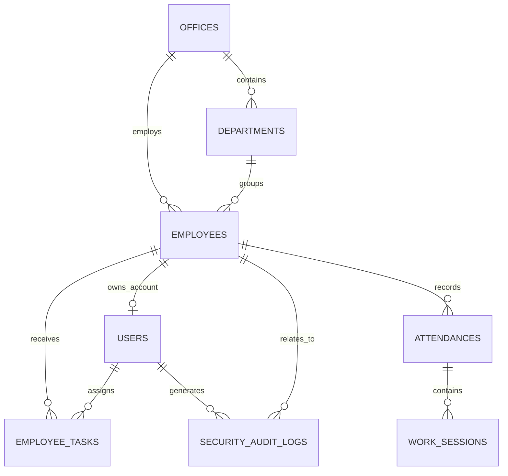

# Dữ liệu, bảo mật và vận hành

## Mô hình dữ liệu



| Bảng/model | Mục đích và trường đáng chú ý |
| --- | --- |
| `offices` / `Office` | Văn phòng: `office_code` duy nhất, tên, địa chỉ, ảnh phòng, trạng thái. |
| `departments` / `Department` | Phòng ban của office; unique theo cặp `office_id + department_code`. |
| `employees` / `Employee` | Hồ sơ nhân viên: mã duy nhất, tên/kana, nhân khẩu học, office/department, liên hệ, avatar, trạng thái. Dùng soft delete. |
| `users` / `User` | Tài khoản đăng nhập, liên kết tối đa một employee, role, active, yêu cầu đổi mật khẩu và lần đăng nhập gần nhất. Password được Laravel hash và ẩn khi serialize. |
| `personal_access_tokens` | Token Sanctum, có thời hạn do AuthController truyền vào khi tạo token. |
| `attendances` / `Attendance` | Một ca làm: employee, ngày, check-in/out, khoảng nghỉ, khoảng ra ngoài/địa điểm và status. Các datetime/date được cast Eloquent. |
| `work_sessions` / `WorkSession` | Công việc theo một attendance: mô tả, bắt đầu/dự kiến/kết thúc và status; index cho `attendance_id + status`. |
| `employee_tasks` / `EmployeeTask` | Việc được giao: người nhận, người giao, mô tả, thời lượng 30/60/120 phút, thời điểm nhận/hoàn tất, `work_session_id` và status theo luồng `pending → accepted → in_progress → completed`. |
| `clients` / `Client` | Hồ sơ khách hàng/依頼者: tên, kana, loại cá nhân/pháp nhân, số điện thoại, email, địa chỉ, quốc tịch và ghi chú. Một client có thể có nhiều `case_files`; dùng soft delete. |
| `case_custom_sections` / `CaseCustomSection` | Tab nghiệp vụ tự do theo `case_file`: tiêu đề, nội dung ghi chú, thứ tự hiển thị và nhân viên tạo. Dùng cho thông tin phát sinh ngoài ba khu vực mặc định. |
| `case_types` / `CaseType` | Nhóm hồ sơ và subtype theo quan hệ cha-con; case thực tế liên kết vào subtype để chọn đúng checklist. |
| `document_templates`, `document_template_items` | Template tài liệu có version, khoảng hiệu lực, nguồn tham chiếu, thứ tự và mức `required/conditional/optional`. |
| `case_documents` / `CaseDocument` | Checklist và tài liệu thực của từng hồ sơ: trạng thái thu thập, hạn nộp, ngày nhận, ngày hết hạn, link file, version và soft delete. Có thể sinh từ template hoặc thêm tự do. |
| `case_parties` / `CaseParty` | Gia đình, công ty, đối phương, bảo hiểm, bệnh viện, người hỗ trợ và các bên phát sinh. |
| `case_deadlines` / `CaseDeadline` | Hạn lưu trú, nộp hồ sơ, bổ sung, thời hiệu, hạn tài liệu và hạn nội bộ. |
| `case_tasks` / `CaseTask` | Task vận hành gắn với hồ sơ, người phụ trách, ưu tiên, deadline và trạng thái. |
| `case_activities` / `CaseActivity` | Timeline liên lạc, sự kiện, nộp hồ sơ, y tế, tai nạn và ghi chú nội bộ. |
| `security_audit_logs` / `SecurityAuditLog` | Nhật ký bất biến theo thời điểm tạo: event/outcome, liên kết user/employee, hash định danh, request metadata. Không có `updated_at`. |
| `cache`, `cache_locks`, `jobs`, `job_batches`, `failed_jobs`, `sessions`, `password_reset_tokens` | Bảng hạ tầng Laravel. |

Migration giữ lịch sử thay đổi schema, không phải nơi để đặt nghiệp vụ mới. Mọi quan hệ được khai báo trong model; khi thêm cột mới cần đồng thời cập nhật migration, `$fillable`, casts (nếu cần), validation/controller, factory/seeder/test và tài liệu API.

Khi tạo hồ sơ với subtype có template đang hiệu lực, `CaseDocumentChecklistService` sao chép template thành checklist riêng trong `case_documents`. Template mới không làm thay đổi hồ sơ đang xử lý; thao tác áp dụng lại là idempotent và chỉ bổ sung item còn thiếu.

## Excel

`AttendanceExcelService` ghi workbook vận hành dùng chung tại `storage/app/attendance/attendance.xlsx` với sheet chấm công và sheet work session. Mọi lần tạo/cập nhật attendance hay work session đều cố đồng bộ workbook; lỗi Excel chỉ ghi warning, không làm hỏng nghiệp vụ chính.

`PersonalAttendanceReportService` khác với workbook trên: nó dựng một file trong bộ nhớ và chỉ stream các record của người đang đăng nhập. Tên file có employee code đã được lọc ký tự an toàn. Nội dung text được xử lý để không biến dữ liệu người dùng thành Excel formula.

### 在留申請進捗管理 (Phase 1)

Không có bảng MySQL nào cho dữ liệu 在留申請 trong Phase 1. Workbook Excel cấu hình trên Google Drive là source of truth và chỉ được tải đọc tạm thời để tạo response API. Dữ liệu không được import, chỉnh sửa hay lưu cache lâu dài vào database. Khi có các sheet `本人情報`, `資料管理`, `請求関係`, dữ liệu được ghép read-only theo `案件ID`; `メッセージリンク` chỉ được trả về khi là URL HTTPS thuộc Messenger/Facebook để tránh liên kết không an toàn từ workbook.

## Bảo mật hiện có

- Sanctum bearer token bảo vệ toàn bộ API ngoài `POST /login`.
- Backend xác định employee từ token, không tin `employee_id` hay tên gửi từ client; attendance và work session luôn kiểm tra ownership.
- Login chặn account không active hoặc employee profile không active, có throttle 5/phút; API đã xác thực throttle 60/phút.
- Tài khoản dùng mật khẩu tạm thời bị chặn khỏi API nghiệp vụ cho đến khi đổi mật khẩu. Đổi mật khẩu thu hồi toàn bộ Sanctum token và bắt đăng nhập lại.
- Seeder tài khoản nhân viên chỉ chạy ở `local/testing`. Nếu một dữ liệu seed cũ vẫn dùng mật khẩu tạm, tài khoản chỉ được phép đăng nhập để đổi mật khẩu; middleware chặn mọi API nghiệp vụ cho đến khi đổi xong.
- CORS allowlist từ `FRONTEND_URL`, `http://localhost:5173` và GitHub Pages; không dùng credential cookie.
- API có `Cache-Control: no-store, private`, CSP `default-src 'none'`, `X-Frame-Options: DENY`, `nosniff`, `no-referrer`, Permissions Policy và HSTS khi production + HTTPS.
- `SecurityAuditLogger` băm định danh bằng `APP_KEY`, loại bỏ metadata có các từ khóa authorization/cookie/password/secret/token, và fail-open để audit không làm gián đoạn app.
- Sự kiện 401/403/429 được deduplicate trong cache một phút để tránh spam log.

## Biến môi trường cần thiết

| Biến | Ứng dụng | Ý nghĩa |
| --- | --- | --- |
| `APP_KEY` | Backend | Khóa Laravel; cũng là secret khi HMAC định danh audit. Không được lộ hoặc thay đổi tùy tiện ở production. |
| `APP_ENV`, `APP_DEBUG`, `APP_URL` | Backend | Môi trường, mức debug và URL public của API. Production phải `APP_DEBUG=false`. |
| `DB_*` | Backend | Driver, máy chủ, database, user và password của cơ sở dữ liệu. |
| `FRONTEND_URL` | Backend | Origin frontend production được phép CORS. |
| `FILESYSTEM_DISK` | Backend | Disk mặc định Laravel; Excel vận hành đang dùng storage local của ứng dụng. |
| `VITE_BACKEND_URL` | Frontend | Gốc backend, ví dụ `https://api.example.com`; được ghép thêm `/api` nếu không đặt `VITE_API_URL`. |
| `VITE_API_URL` | Frontend | URL API đầy đủ; ưu tiên hơn `VITE_BACKEND_URL`, ví dụ `https://api.example.com/api`. |

Biến `VITE_*` được nhúng vào bundle tại thời điểm build, nên không đặt secret trong chúng. Sau khi thêm/sửa biến Vite cần chạy lại build/dev server.

## Lệnh vận hành

```powershell
# Backend
Set-Location EmployeeManagement/backend
php artisan migrate --seed
php artisan test
php artisan config:clear

# Khôi phục tài khoản đã bị vô hiệu hóa do còn mật khẩu seed mặc định.
# Mật khẩu được nhập ẩn và không xuất hiện trong shell history.
php artisan themis:user-password TM001 --activate

# Frontend
Set-Location ../frontend
npm run lint
npm run build
npm run preview
```

`composer test` cũng xóa config cache trước khi chạy PHPUnit. `railway.json` chạy migration rồi seeder trước deploy; production seeder chỉ tạo dữ liệu nền như office, role, persona và case type, không tạo tài khoản đăng nhập. Cấu hình service Railway phải dùng working directory có `artisan` (hiện là `EmployeeManagement/backend`).

## Bộ kiểm thử

| Nhóm test | Phạm vi |
| --- | --- |
| `AuthTokenTest`, `AttendanceAuthorizationTest`, `AttendanceProfileTest` | Token, profile hiển thị, ownership và dữ liệu attendance cũ. |
| `AttendanceOutsideStatusTest`, `WorkSessionTest` | Chuyển trạng thái ngoài văn phòng, quy tắc thời gian và vòng đời work session. |
| `PersonalAttendanceReportTest`, `AttendanceExcelServiceTest` | Cô lập dữ liệu báo cáo cá nhân, chống Excel formula injection và layout workbook. |
| `ApiSecurityTest`, `SecurityAuditLogTest` | CORS, security header, rate limit, audit và lọc dữ liệu nhạy cảm. |
| `PasswordSecurityTest` | Bắt buộc đổi mật khẩu, thu hồi token, khóa credential seed cũ và lệnh khôi phục tài khoản. |

Khi sửa API hoặc schema, hãy thêm test vào đúng nhóm và chạy toàn bộ `php artisan test` trước khi deploy.
